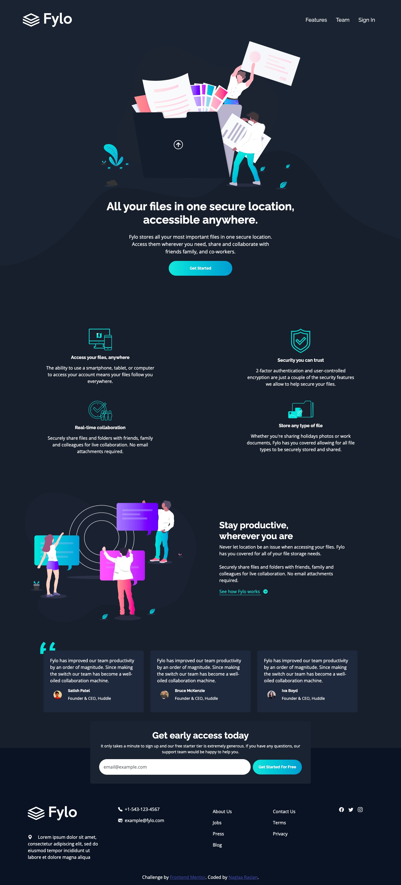
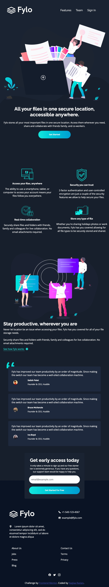
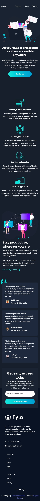

# Fylo-landing-page-with-dark-theme-and-features-grid
# Frontend Mentor - Fylo dark theme landing page solution

This is a solution to the [Fylo dark theme landing page challenge on Frontend Mentor](https://www.frontendmentor.io/challenges/fylo-dark-theme-landing-page-5ca5f2d21e82137ec91a50fd). Frontend Mentor challenges help you improve your coding skills by building realistic projects. 

## Table of contents

- [Overview](#overview)
  - [The challenge](#the-challenge)
  - [Screenshot](#screenshot)
  - [Links](#links)
- [My process](#my-process)
  - [Built with](#built-with)

- [Author](#author)

**Note: Delete this note and update the table of contents based on what sections you keep.**

## Overview

### The challenge

Users should be able to:

- View the optimal layout for the site depending on their device's screen size
- See hover states for all interactive elements on the page

### Screenshot
- Desktop :;

- Ipad :

- Mobile :;

### Links
- Solution URL: [Github REpo](https://github.com/codeAndcocoa/Fylo-landing-page-with-dark-theme-and-features-grid.git)

- Live Site URL: [Live site](https://codeandcocoa.github.io/Fylo-landing-page-with-dark-theme-and-features-grid/)

## My process

### Built with

- Semantic HTML5 markup
- CSS custom properties
- Flexbox
- CSS Grid
- Mobile-first workflow
- Bootstrap 5

## Author

- Website - [Github profile](https://github.com/codeAndcocoa)
- Frontend Mentor - [@codeAndcocoa](https://www.frontendmentor.io/profile/codeAndcocoa)
